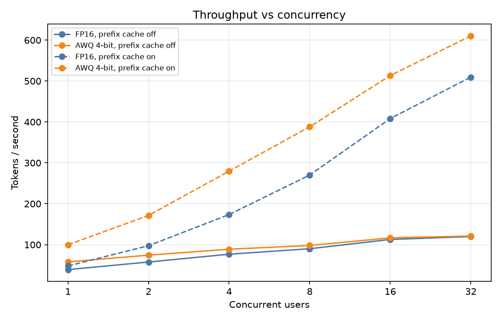
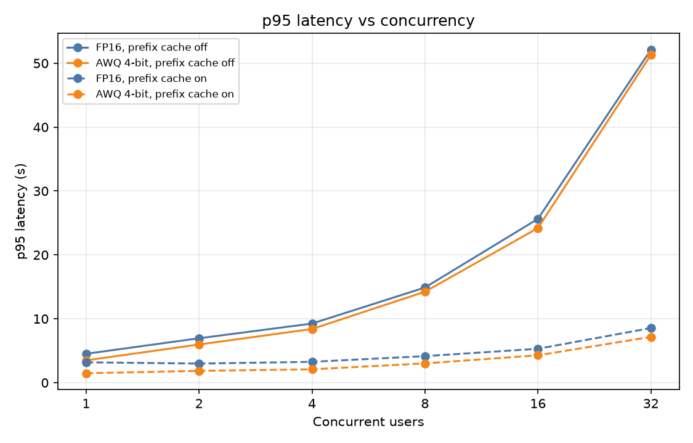
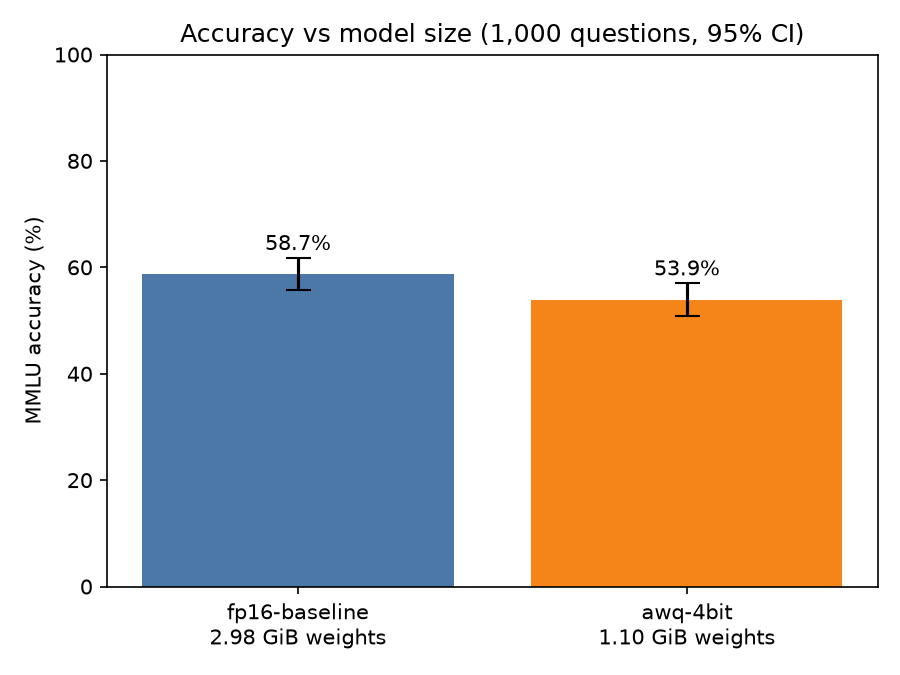
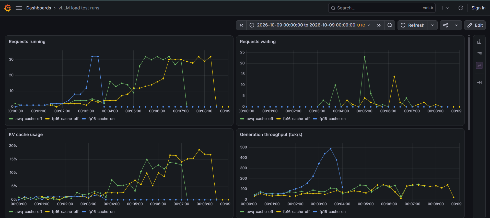
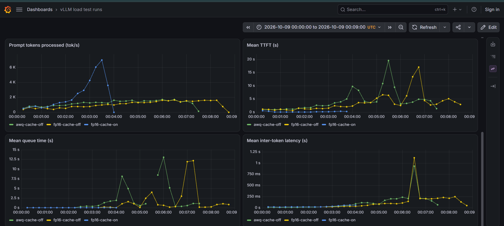

# LLM Serving, Quantization and Evaluation Pipeline

Benchmarks a small open LLM served with vLLM, compares FP16 against 4-bit AWQ on speed, memory and answer quality, gates model releases on measured results, and visualizes server behavior with Prometheus and Grafana.

All results were produced on free-tier hardware (Google Colab T4, 15 GB).

**Status:** serving, benchmarking, quality evaluation, release gate and server-metrics dashboard are complete. Request tracing, LoRA serving and LLM-judge evaluation are on the roadmap below.

## Headline results

Model: `Qwen/Qwen2.5-1.5B-Instruct` (FP16) vs `Qwen/Qwen2.5-1.5B-Instruct-AWQ` (4-bit).

| Metric | FP16 | AWQ 4-bit | Change |
|---|---|---|---|
| Weight memory | 2.98 GiB | 1.10 GiB | -63% |
| MMLU accuracy (1,000 questions) | 58.7% | 53.9% | -4.8 pts (p = 0.0001) |
| Throughput, 1 user (no prefix cache) | 39.1 tok/s | 57.9 tok/s | 1.48x |
| Throughput, 32 users (no prefix cache) | 119.9 tok/s | 121.1 tok/s | 1.01x |
| p95 latency, 16 users (no prefix cache) | 25.6 s | 24.2 s | -5.6% |

The release gate **rejects** AWQ for this model under both traffic profiles: latency improves, but the accuracy drop exceeds the 3-point limit.





## Finding 1: prefix caching dominated the first benchmark

The first benchmark ran with vLLM's prefix caching enabled. A check of the recorded server metrics showed a **98.6% prefix-cache hit rate**: the synthetic prompts repeat the same text, and each concurrency level reuses the same prompts, so most prefill work was skipped. I re-ran both variants with `--no-enable-prefix-caching`, and keep both sets of results.

| FP16 at 32 users | Cache on | Cache off | Change |
|---|---|---|---|
| Throughput | 510 tok/s | 120 tok/s | 4.3x lower |
| p95 latency | 8.6 s | 52.1 s | 6.1x higher |
| p95 TTFT | 0.70 s | 25.1 s | 36x higher |

Cache-on numbers are the best case for traffic with heavily repeated prefixes (for example a shared system prompt). Cache-off numbers are the conservative baseline.

## Finding 2: AWQ's speed advantage depends on load and workload

**Prefix cache off (conservative baseline)**

| Users | FP16 tok/s | AWQ tok/s | Speedup | p95 latency FP16 | p95 latency AWQ | Change |
|---|---|---|---|---|---|---|
| 1 | 39.1 | 57.9 | 1.48x | 4.52 s | 3.49 s | -22.8% |
| 2 | 57.6 | 74.5 | 1.29x | 6.95 s | 5.97 s | -14.0% |
| 4 | 76.8 | 88.9 | 1.16x | 9.25 s | 8.40 s | -9.2% |
| 8 | 90.1 | 98.0 | 1.09x | 14.89 s | 14.23 s | -4.4% |
| 16 | 112.8 | 116.7 | 1.04x | 25.64 s | 24.20 s | -5.6% |
| 32 | 119.9 | 121.1 | 1.01x | 52.11 s | 51.32 s | -1.5% |

**Prefix cache on (best case)**

| Users | FP16 tok/s | AWQ tok/s | Speedup | p95 latency FP16 | p95 latency AWQ | Change |
|---|---|---|---|---|---|---|
| 1 | 48.1 | 99.9 | 2.08x | 3.19 s | 1.48 s | -53.7% |
| 2 | 97.6 | 171.5 | 1.76x | 2.99 s | 1.85 s | -38.2% |
| 4 | 173.6 | 279.7 | 1.61x | 3.26 s | 2.09 s | -36.0% |
| 8 | 270.3 | 388.1 | 1.44x | 4.15 s | 3.02 s | -27.4% |
| 16 | 408.3 | 513.4 | 1.26x | 5.31 s | 4.28 s | -19.3% |
| 32 | 509.6 | 610.3 | 1.20x | 8.55 s | 7.17 s | -16.2% |

Interpretation:
- At low load, token generation is limited by memory bandwidth (reading weights), so 4-bit weights help (inter-token latency at 1 user: 18.3 ms → 9.6 ms without caching).
- Under heavy load with real prefill, throughput saturates at about 120 tok/s for both variants. Prompt processing is compute-bound and 4-bit weights do not speed it up.
- Time to first token is not improved by AWQ (p95 TTFT without caching: 2.08 s vs 2.11 s at 1 user, 25.1 s vs 25.0 s at 32 users).

## Finding 3: the quality cost is statistically significant

Both variants answered the same 1,000 MMLU test questions (sampled with a fixed seed, temperature 0, scored by exact letter match). A paired McNemar exact test found 100 questions only FP16 answered correctly and 52 only AWQ answered correctly.

- Accuracy: 58.7% (FP16) vs 53.9% (AWQ), 95% CI of each ±3.1 pts
- Paired difference: 4.8 pts, 95% CI 2.4 to 7.2, p = 0.0001

## Release gate

`bench/gate.py` approves a candidate only if both hold against the baseline:
- accuracy drops by at most 3 points
- p95 latency at 16 users is at most 10% worse

It exits non-zero on rejection. A GitHub Actions workflow (`.github/workflows/gate.yml`) runs it on committed results and passes only if the known-bad candidate (AWQ) is correctly rejected, so it works as a regression test of the gate itself.

```
python bench/gate.py fp16-baseline awq-4bit
python bench/gate.py fp16-nocache awq-nocache fp16-baseline awq-4bit
```

## Observability

vLLM's `/metrics` endpoint was recorded once per second during each load test. The recordings are converted to OpenMetrics, loaded into a local Prometheus with `promtool tsdb create-blocks-from openmetrics`, and shown in a provisioned Grafana dashboard (8 panels: running and waiting requests, KV cache usage, generation and prompt throughput, mean TTFT, queue time, inter-token latency) with the three recorded runs overlaid.




What the dashboard showed:
- With prefix caching on, the server never queued a request (0 waiting, 0 preemptions) and KV cache usage peaked at 2.5%.
- With caching off, requests queued (peak of about 23 waiting for AWQ and 14 for FP16) and KV cache usage rose to roughly 15 to 18%.
- In the cached run, mean prefill time was 127 ms against 5,001 ms of decode per request.

Server metrics were recorded for three runs (FP16 cache on, FP16 cache off, AWQ cache off). AWQ with cache on was not recorded.

## Method

- **Server:** vLLM OpenAI-compatible API, `--dtype half`, `--max-model-len 4096`, `--gpu-memory-utilization 0.85`.
- **Load test:** async streaming client run inside the same Colab notebook against localhost (no network noise). Concurrency levels 1, 2, 4, 8, 16, 32; 128 output tokens fixed with `ignore_eos`; temperature 0; mixed prompt lengths (about 0.4K, 1.2K and 3.3K tokens, average about 1.7K as counted by vLLM); fixed seed so both variants see identical traffic; discarded warmup run. Metrics: throughput, TTFT, inter-token latency, p50/p95/p99 latency.
- **Quality:** 1,000 MMLU test questions, seed 42, same questions for every variant.
- **Weight memory:** read from vLLM's "Model loading took" log line. Total GPU memory used is not comparable between variants because vLLM reserves a fixed share for the KV cache.

## Repository layout

```
bench/load_test.py             async load test (run in Colab)
bench/gate.py                  release gate
bench/plot.py                  throughput, latency and accuracy charts
bench/plot_metrics.py          server-metrics chart from a recorded run
bench/check_prefix_cache.py    prefix-cache hit rate from recorded metrics
bench/export_openmetrics.py    recorded metrics -> OpenMetrics file
bench/make_dashboard.py        generates the Grafana dashboard JSON
eval/mmlu_eval.py              MMLU quality eval (run in Colab)
dashboards/                    Docker Compose, Prometheus and Grafana config
results/                       raw benchmark, eval and metrics JSON
docs/                          generated charts and dashboard screenshots
.github/workflows/gate.yml     CI check for the release gate
```

## Reproduce

1. In Colab (T4 GPU): `pip install vllm openai`, restart the session, mount Drive.
2. Start the server for a variant (add `--no-enable-prefix-caching` for the cache-off runs), run `bench/load_test.py` and `eval/mmlu_eval.py`, and save the JSON files to `results/` using the names `<label>.json` and `eval-<label>.json`.
3. Locally: `pip install matplotlib`, then `python bench/plot.py` and `python bench/gate.py fp16-baseline awq-4bit`.
4. Dashboard (requires Docker):
```
   python bench/export_openmetrics.py
   docker run --rm -v "${PWD}\dashboards\data:/work" --entrypoint promtool prom/prometheus tsdb create-blocks-from openmetrics /work/runs.om /work/prom-data
   python bench/make_dashboard.py
   docker compose -f dashboards/docker-compose.yml up -d
```
   Open http://localhost:3000 and set the time range to 2026-10-09 00:00 to 00:09 UTC.

## Limitations

- One model (1.5B) and one quality benchmark (MMLU). Small models tend to lose more from 4-bit quantization than larger ones, so the quality result should not be generalized.
- Synthetic prompts built from repeated text, not real traffic. Cache-on results are a best case.
- Free-tier T4 only: no FP8, and results will differ on newer GPUs.
- Each configuration was run once, except FP16 with prefix cache on, which was run twice: from 2 to 32 users the runs agreed within about 3% on throughput and 2% on p95 latency; the 1-user case varied by 17%.
- p95 TTFT is noisy at high load, so small TTFT differences between variants should not be over-interpreted.

## Roadmap

- FastAPI gateway in front of vLLM with OpenTelemetry tracing into Langfuse (per-request traces and cost)
- LoRA adapter variant and multi-LoRA serving
- Task-specific golden set with a calibrated LLM-as-judge evaluation
- Additional variants: GPTQ and speculative decoding
- Locust load test and higher concurrency levels (64 and above)
- Release gate that blocks a deployment, not only a regression test of the gate
